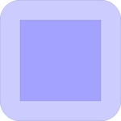
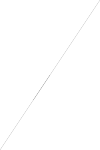
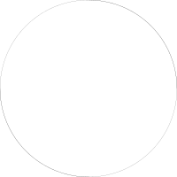
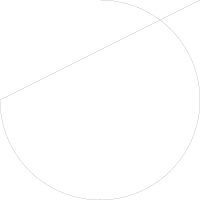
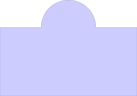
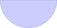
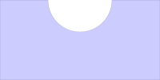
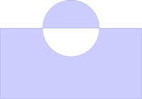
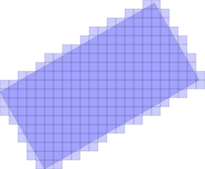
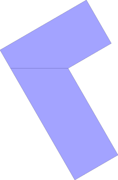

# Shape

Geometry library used in [PackingSolver](https://github.com/fontanf/packingsolver)

The main particularity of this library is that shapes primitives might be line segments and/or circular arcs. The library is also designed to be robust and return 'expected outputs' over being fast.

## Examples

### Inflate generating circular arcs on vertices


```c++
#include "shape/offset.hpp"

shape::Shape square = shape::build_square(100);
shape::ShapeWithHoles inflated_square = shape::inflate(square, 25);
std::cout << inflated_square.to_string(2) << std::endl;
shape::Writer().add_shape(square).add_shape_with_holes(inflated_square).write_svg("tmp.svg");
std::system(std::string("convert \"tmp.svg\" \"tmp.png\"").c_str()); im::image image("tmp.png"); image
```

    shape shape (# elements 8)
      CircularArc start (125, 100) end (100, 125) center (100, 100) orientation Anticlockwise
      LineSegment start (100, 125) end (0, 125)
      CircularArc start (0, 125) end (-25, 100) center (0, 100) orientation Anticlockwise
      LineSegment start (-25, 100) end (-25, 0)
      CircularArc start (-25, 0) end (0, -25) center (0, 0) orientation Anticlockwise
      LineSegment start (0, -25) end (100, -25)
      CircularArc start (100, -25) end (125, 0) center (100, 0) orientation Anticlockwise
      LineSegment start (125, 0) end (125, 100)
    


    

    


### Intersection between two overlapping line segments


```c++
#include "shape/elements_intersections.hpp"

shape::ShapeElement line_segment_1 = shape::build_line_segment({100, 150}, {0, 0});
shape::ShapeElement line_segment_2 = shape::build_line_segment({33.33333333333334, 50}, {50, 75});
shape::ShapeElementIntersectionsOutput intersections = compute_intersections(line_segment_1, line_segment_2);
std::cout << intersections.to_string(0) << std::endl;
shape::Writer().add_element(line_segment_1).add_element(line_segment_2).write_svg("tmp.svg");
std::system(std::string("convert \"tmp.svg\" \"tmp.png\"").c_str()); im::image image("tmp.png"); image
```

    overlapping parts:
    - LineSegment start (50, 75) end (33.333333333333343, 50)
    improper intersections:
    proper intersections:


    

    


### Intersection between two circular arcs overlapping twice


```c++
#include "shape/elements_intersections.hpp"

shape::ShapeElement circular_arc_1 = shape::build_circular_arc({100, 0}, {0, -100}, {0, 0}, shape::ShapeElementOrientation::Anticlockwise);
shape::ShapeElement circular_arc_2 = shape::build_circular_arc({-100, 0}, {0, 100}, {0, 0}, shape::ShapeElementOrientation::Anticlockwise);
shape::ShapeElementIntersectionsOutput intersections = compute_intersections(circular_arc_1, circular_arc_2);
std::cout << intersections.to_string(0) << std::endl;
shape::Writer().add_element(circular_arc_1).add_element(circular_arc_2).write_svg("tmp.svg");
std::system(std::string("convert \"tmp.svg\" \"tmp.png\"").c_str()); im::image image("tmp.png"); image
```

    overlapping parts:
    - CircularArc start (-100, 0) end (0, -100) center (0, 0) orientation Anticlockwise
    - CircularArc start (100, 0) end (0, 100) center (0, 0) orientation Anticlockwise
    improper intersections:
    proper intersections:


    

    


### Intersection between a line segment and a circular arc


```c++
#include "shape/elements_intersections.hpp"

shape::ShapeElement line_segment = shape::build_line_segment({-100, 0}, {100, 100});
shape::ShapeElement circular_arc = shape::build_circular_arc({-100, 0}, {0, 100}, {0, 0}, shape::ShapeElementOrientation::Anticlockwise);
shape::ShapeElementIntersectionsOutput intersections = compute_intersections(line_segment, circular_arc);
std::cout << intersections.to_string(0) << std::endl;
shape::Writer().add_element(line_segment).add_element(circular_arc).write_svg("tmp.svg");
std::system(std::string("convert \"tmp.svg\" \"tmp.png\"").c_str()); im::image image("tmp.png"); image
```

    overlapping parts:
    improper intersections:
    - (-100, 0)
    proper intersections:
    - (60, 80)


    

    


### Union between a rectangle and a circle


```c++
#include "shape/boolean_operations.hpp"

shape::Shape rectangle = shape::build_rectangle(200, 100);
shape::Shape circle = shape::build_circle(40).shift(100, 100);
std::vector<shape::ShapeWithHoles> result = shape::compute_union({{rectangle}, {circle}});
for (const shape::ShapeWithHoles& shape: result)
    std::cout << shape.to_string(0) << std::endl;
shape::Writer().add_shapes_with_holes(result).write_svg("tmp.svg");
std::system(std::string("convert \"tmp.svg\" \"tmp.png\"").c_str()); im::image image("tmp.png"); image
```

    shape shape (# elements 6)
    LineSegment start (200, 100) end (140, 100)
    CircularArc start (140, 100) end (60, 100) center (100, 100) orientation Anticlockwise
    LineSegment start (60, 100) end (0, 100)
    LineSegment start (0, 100) end (0, 0)
    LineSegment start (0, 0) end (200, 0)
    LineSegment start (200, 0) end (200, 100)
    


    

    


### Intersection between a rectangle and a circle


```c++
#include "shape/boolean_operations.hpp"

shape::Shape rectangle = shape::build_rectangle(200, 100);
shape::Shape circle = shape::build_circle(40).shift(100, 100);
std::vector<shape::ShapeWithHoles> result = shape::compute_intersection({{rectangle}, {circle}});
for (const shape::ShapeWithHoles& shape: result)
    std::cout << shape.to_string(0) << std::endl;
shape::Writer().add_shapes_with_holes(result).write_svg("tmp.svg");
std::system(std::string("convert \"tmp.svg\" \"tmp.png\"").c_str()); im::image image("tmp.png"); image
```

    shape shape (# elements 2)
    LineSegment start (140, 100) end (60, 100)
    CircularArc start (60, 100) end (140, 100) center (100, 100) orientation Anticlockwise
    


    

    


### Difference between a rectangle and a circle


```c++
#include "shape/boolean_operations.hpp"

shape::Shape rectangle = shape::build_rectangle(200, 100);
shape::Shape circle = shape::build_circle(40).shift(100, 100);
std::vector<shape::ShapeWithHoles> result = shape::compute_difference({rectangle}, {{circle}});
for (const shape::ShapeWithHoles& shape: result)
    std::cout << shape.to_string(0) << std::endl;
shape::Writer().add_shapes_with_holes(result).write_svg("tmp.svg");
std::system(std::string("convert \"tmp.svg\" \"tmp.png\"").c_str()); im::image image("tmp.png"); image
```

    shape shape (# elements 6)
    LineSegment start (200, 100) end (140, 100)
    CircularArc start (140, 100) end (60, 100) center (100, 100) orientation Clockwise
    LineSegment start (60, 100) end (0, 100)
    LineSegment start (0, 100) end (0, 0)
    LineSegment start (0, 0) end (200, 0)
    LineSegment start (200, 0) end (200, 100)
    


    

    


### Symmetric difference between a rectangle and a circle


```c++
#include "shape/boolean_operations.hpp"

shape::Shape rectangle = shape::build_rectangle(200, 100);
shape::Shape circle = shape::build_circle(40).shift(100, 100);
std::vector<shape::ShapeWithHoles> result = shape::compute_symmetric_difference({rectangle}, {circle});
for (const shape::ShapeWithHoles& shape: result)
    std::cout << shape.to_string(0) << std::endl;
shape::Writer().add_shapes_with_holes(result).write_svg("tmp.svg");
std::system(std::string("convert \"tmp.svg\" \"tmp.png\"").c_str()); im::image image("tmp.png"); image
```

    shape shape (# elements 6)
    LineSegment start (200, 100) end (140, 100)
    CircularArc start (140, 100) end (60, 100) center (100, 100) orientation Clockwise
    LineSegment start (60, 100) end (0, 100)
    LineSegment start (0, 100) end (0, 0)
    LineSegment start (0, 0) end (200, 0)
    LineSegment start (200, 0) end (200, 100)
    
    shape shape (# elements 2)
    CircularArc start (140, 100) end (60, 100) center (100, 100) orientation Anticlockwise
    LineSegment start (60, 100) end (140, 100)
    


    

    


### Rasterization


```c++
#include "shape/rasterization.hpp"

shape::LengthDbl cell_width = 10;
shape::LengthDbl cell_height = 10;
shape::ShapeWithHoles input;
input.shape = shape::build_rectangle(200, 100).rotate(30);
std::vector<shape::IntersectedCell> rasterization_output = shape::rasterization(input, cell_width, cell_height);
std::vector<shape::ShapeWithHoles> cells;
for (const shape::IntersectedCell& cell: rasterization_output)
    cells.push_back({shape::cell_to_shape(cell.cell, cell_width, cell_height)});
shape::Writer().add_shape_with_holes(input).add_shapes_with_holes(cells).write_svg("tmp.svg");
std::system(std::string("convert \"tmp.svg\" \"tmp.png\"").c_str()); im::image image("tmp.png"); image
```


    

    


### Convex partition


```c++
#include "shape/convex_partition.hpp"

shape::ShapeWithHoles input = shape::compute_union({
        {shape::build_rectangle(200, 100).rotate(300)},
        {shape::build_rectangle(200, 100).rotate(30)}}).front();
std::vector<shape::Shape> convex_parts = shape::compute_convex_partition(input);
shape::Writer().add_shape_with_holes(input).add_shapes(convex_parts).write_svg("tmp.svg");
std::system(std::string("convert \"tmp.svg\" \"tmp.png\"").c_str()); im::image image("tmp.png"); image
```


    

    


